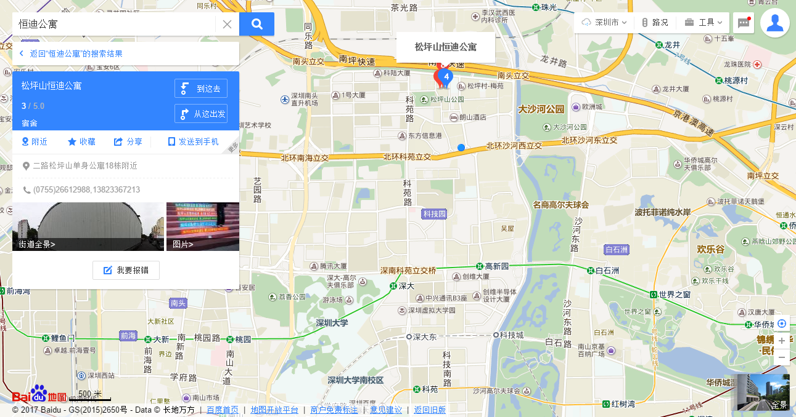

## [转租] 深圳科技园附近一间单身公寓

由于本人原因，年后可能会离开深圳，因此，希望有意在年后（即二月初）在**深圳科技园附近**找房子住的希望能考虑一下。房租**2500一个月**，本人加上水电即便在夏天开着空调也不会超过2800。本来宽带是100一个月，但是，我破解了隔壁家邻居的 Wifi，因此可以享受**免费 Wifi**。此外，如果你想看电视，这里只需要每个月多交70多的电视费就可以享受大屏幕电视的使用（可以用来打游戏）。

该公寓位于松坪山公园附近，名为恒迪公寓11栋。地图如下：

